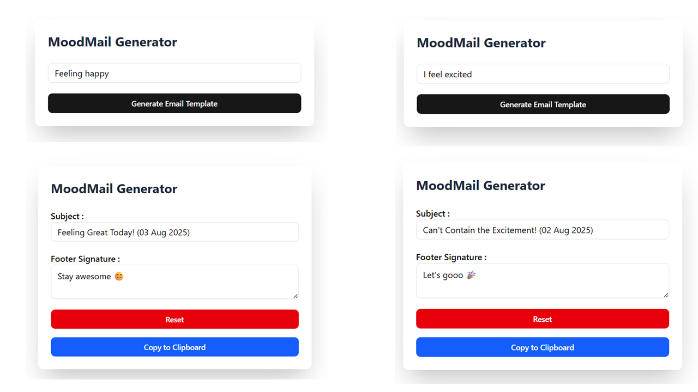

# 📩 MoodMail – Emotion-Based Email Generator

🔥 **Day 02 of 30 – CodeJavid Challenge**

MoodMail is a fun and practical React app that generates a creative **email subject line** and **emoji footer** based on the user's current mood. It mimics real-world dynamic input handling, like customizing automated messages or emotion-aware UI.

---

## 🎯 Features

- 🌈 Converts mood (e.g., `happy`, `sad`) into subject & footer
- 📆 Appends **today’s date** to the subject line
- 📋 **Copy to Clipboard** button for both subject and footer
- 🔁 Real-time updates using React Hooks
- 🎨 Minimal, clean UI built with Tailwind CSS + ShadCN UI
- 🗂️ Clean file separation for reusability and scaling

---

## 🧠 What I Learned

- Using `useState()` to manage user input and outputs
- Mapping logic via `if / else if / else` for mood-based decisions
- Normalizing strings using `toLowerCase()` and `.includes()`
- Appending dates via `new Date().toDateString()`
- Implementing the Clipboard API using `navigator.clipboard.writeText()`
- Tailwind + ShadCN styling and component composition

---

## 🛠️ Tech Stack

- ⚛️ React (with Vite)
- 🧠 TypeScript
- 🎨 Tailwind CSS
- 🧱 ShadCN UI Components
- 🔜 Firebase (coming in Day 3)

---

## 🚀 How to Run

```bash
# Clone the repo
git clone https://github.com/PARAMASIVAM-R/30DaysOfCode.git

# Navigate to Day 2 folder
cd 30DaysOfCode/02_MoodMail

# Install dependencies
npm install

# Start the dev server
npm run dev





