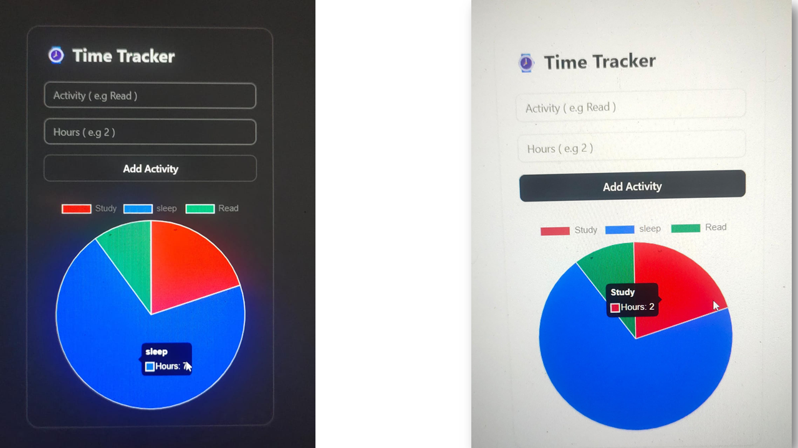

# ⏱️ Time Tracker – Pie Chart Visualization App

🔥 **Day 03 of 30 – CodeJavid Challenge**

This project is a beginner-friendly **React app** that lets users enter daily tasks with durations (like “Coding – 4hrs”, “Exercise – 1hr”), and instantly displays a **Pie Chart** visualization using Chart.js. Great for practicing dynamic UI logic, component reuse, and data visualization in React.

---

## 📸 Preview


---

## 🎯 Features

- ✅ Add daily activities with labels and time
- ✅ Visualize data as a colorful, real-time **Pie Chart**
- ✅ Form validation and dynamic list handling
- ✅ Clean UI with Tailwind CSS & ShadCN components
- ✅ Reusable component structure (Form + Chart)

---

## 🧠 What I Learned

- Using `react-chartjs-2` with `Chart.js` in React  
- Managing dynamic arrays with `useState()`  
- Creating modular components for form and chart  
- Styling with **Tailwind CSS** + **ShadCN UI**  
- Structuring React apps for scalability

---

## 🛠️ Tech Stack

- ⚛️ React + Vite (TypeScript)  
- 🎨 Tailwind CSS  
- 🧱 ShadCN UI  
- 📊 Chart.js (`react-chartjs-2`)

---

## 🚀 How to Run

```bash
# Clone the repo
git clone https://github.com/PARAMASIVAM-R/30DaysOfCode.git

# Navigate to the Day 3 folder
cd 30DaysOfCode/03_TimeTracker

# Install dependencies
npm install

# Start the development server
npm run dev


