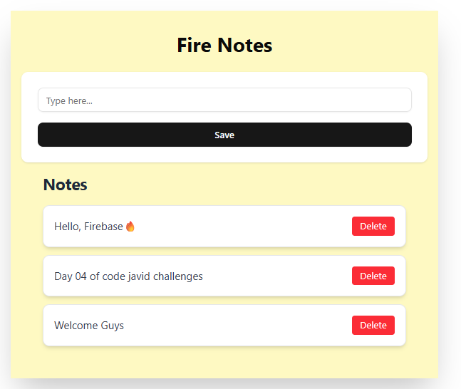

# 📝 Firebase Notes App – Real-Time Note Taking with React + Firestore

🔥 **Day 04 of 30 – CodeJavid Challenge**

This project is a real-time **notes app** built using **React**, **Tailwind CSS**, **ShadCN UI**, and **Firebase Firestore**. Users can add and delete notes with immediate syncing thanks to Firestore’s `onSnapshot()` listener.

This is the first **full-stack** project in the 30-day challenge — perfect for learning real-world Firebase integration in modern React apps.

---

## 📸 Preview



---

## 🎯 Features

- ✅ Add notes and sync them live to Firestore  
- ✅ Real-time updates via Firestore `onSnapshot()`  
- ✅ Delete notes with instant feedback  
- ✅ Clean UI built with Tailwind CSS + ShadCN  
- ✅ Firebase abstraction via `lib/firebase.ts`  
- ✅ Modular, reusable React component structure  

---

## 🧠 What I Learned

- Integrating Firebase Firestore into React  
- Using `addDoc()`, `deleteDoc()`, and `collection()`  
- Listening for live updates with `onSnapshot()`  
- Separating Firebase logic from components  
- Styling a real-world app using Tailwind + ShadCN  
- Structuring full-stack apps cleanly

---

## 🛠️ Tech Stack

- ⚛️ React + Vite (TypeScript)  
- 🎨 Tailwind CSS  
- 🧱 ShadCN UI  
- 🔥 Firebase Firestore

---

## 🚀 How to Run

```bash
# Clone the repo
git clone https://github.com/PARAMASIVAM-R/30DaysOfCode.git

# Navigate to Day 4 folder
cd 30DaysOfCode/04_NotesApp

# Install dependencies
npm install

# Start the dev server
npm run dev


